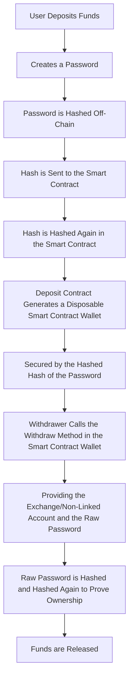

# Hawler - Stealth Crypto Payment Platform

Hawler is a stealth crypto payment platform built with Angular and Solidity. It allows users to send payments psuedo-anonymously while providing a layer of privacy. The smart contracts have been deployed to Polygon zkEVM, Scroll, Gnosis Chain, and Mantle test networks with the following contract addresses:

Polygon zkEVM: 0x1D4d13B3cbc4C36506645cDF3b5c8826AB495969
Scroll: 0xaF52Fe8cb0745063Dfc8771929440e2F976a73C4
Gnosis Chain: 0xdd7a3Fb3dAaEf50e1F693A5c780c784De0eD7fE6
Mantle: 0x0FC4262580c16ef00689157E264500f9401fE684

## How it Works

## Notice
Please note that the project is not audited and should only be used in testnet.

## License
This project is licensed under the MIT License.
